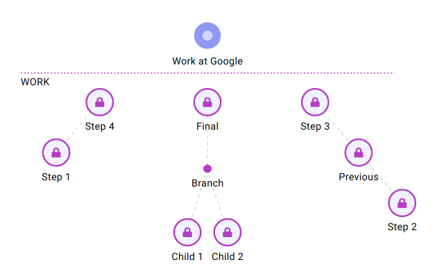

Note: this repo is not for development, but for code showcase only.

# Plan Maps

Web service for visualizing plans using tree-like structures. Teamwork with @nikitavbv.

#### Build a plan map

Create a clear plan, organizing your tasks into steps, branches and stages.

#### Track progress

Update task state while working towards your goal.

#### Collaborate

Invite people to view, edit or co-own your plan.

#### Offline mode

Work offline - changes will be saved when internet connection is restored. 

-----

#### Technologies

* Typescript
* React
* Redux + Redux Thunk
* Less
* Node.js + Koa
* Postgres
* Jest
* Tslint, Stylelint
