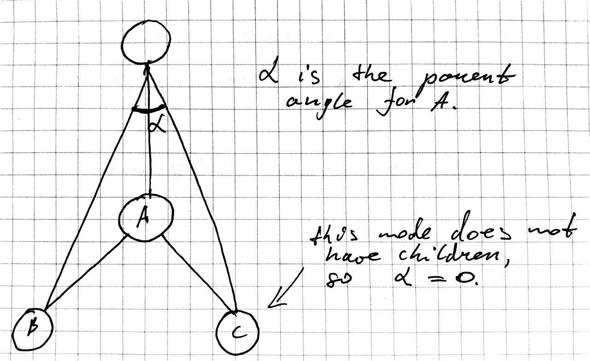

# Notes on tree rendering implementation

Structurelly, tree is represented as a collection of:
    - steps - smallest component of the tree.
    - branches - represents track of work (steps), may have nesting branches.
    - stages - collection of steps and branches.

Tree consists of sequential stages, while each stage consists of branches and steps.

# Calculating nodes coordinates

Firstly, we iterate over all stages and calculate angles and coordinates of all child nodes (see `PlanChartView.getNodesCoordinates`).

## Angles calculation

Angles are calculated for each node recursively (see `PlanNode.getAnglesAlgoStep`).

Child `parentAngle`s are calcualted first with `setLowerNodesParentAngle`. Then minimum angle which child nodes take up is found (`getNodesArrayAnglesSum`). After that for each node `ownAngle` is calculated - angle relative to the parent node direction (see `setNodesRelativeOwnAnglesByAnglesSum`) - based on `parentAngle`.
If we add `ownAngle` to parent `ownAngle`, we get angle relative to the tree direction.
Finally, border length and angle are updated.

## Coordinates calculation

Each stage coordinates are calculated, then its head nodes and inner nodes.
Each node coordinates are calculated based on parent position, `ownAngle` and distance between this node and parent node.

# First render

Now, when each node coordinates are calculated, they are set as `transform` in svg. Finally, all nodes (steps, branches, stages) are added to tree svg as SVGElement.

# Possible improvements

TBD